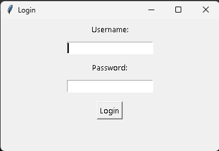
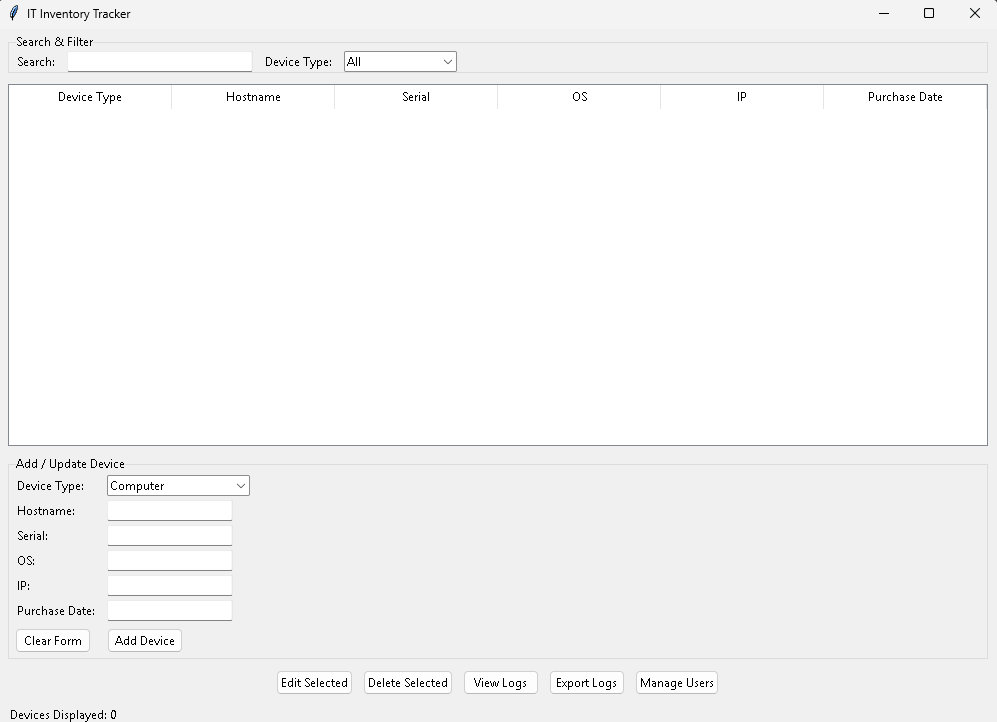

# IT Inventory Tracker

A desktop application for tracking and managing IT devices in an organization. Built with Python and Tkinter, this app supports role-based user access, device history logging, and exportable records. This is just for fun and learning, had help with ChatGPT to fix bugs.

## 🔧 Features

- Add, update, and delete IT inventory items (PCs, monitors, phones, etc.)
- Role-based authentication (admin vs basic user)
- Per-device change logs for accountability
- CSV export for audit/reporting
- User account management (admin only)
- Filter/search functionality
- SQLite database backend

## Bugs

No button for admin to create and initialize a new user.

## 🖥️ User Roles

- **Admin**: Full access to manage devices and users
- **Basic User**: View-only access and device updates, no user management

## 📦 Requirements

Install dependencies with:

```bash
pip install -r requirements.txt
```


